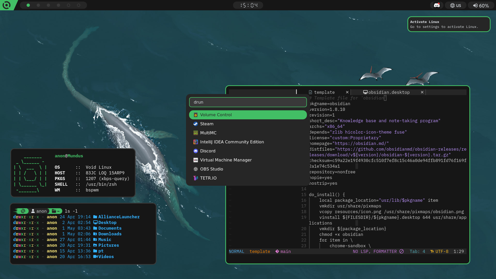

## Overview
| Component          | Program                                                      |
| ------------------ | ------------------------------------------------------------ |
| **Window Manager** | `bspwm`                                                      |
| **Panel**          | `polybar`                                                    |
| **Terminal**       | `alacritty`                                                  |
| **ls replacemet**  | `eza`                                                        |
| **App Launcher**   | `rofi`                                                       |
| **Notifications**  | `dunst`                                                      |
| **Shell**          | `zsh` with `oh-my-zsh`                                       |
| **Editor**         | `neovim` ([config](https://github.com/nar1nari/nvim-config)) |
| **Compositor**     | `picom`                                                      |
| **Wallpaper**      | `feh`                                                        |
| **GTK Theme**      | `Orchis-Green-Dark`                                          |
| **Icons**          | `Papirus-Dark`                                               |
| **Fonts**          | `BlexMono Nerd Font`, `Ubuntu`, `E1234`                      |

## Installation
1. Install all required components
2. Clone the repo
3. Copy all files to your home directory if you are feeling lucky
3. Start BSPWM and Picom and everything should work fine

For shell theme you need to copy [my_awesome_theme.zsh-theme](./my_awesome_theme.zsh-theme) to `.oh-my-zsh/custom/themes`
